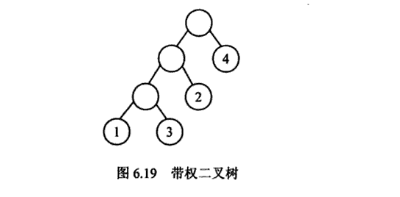
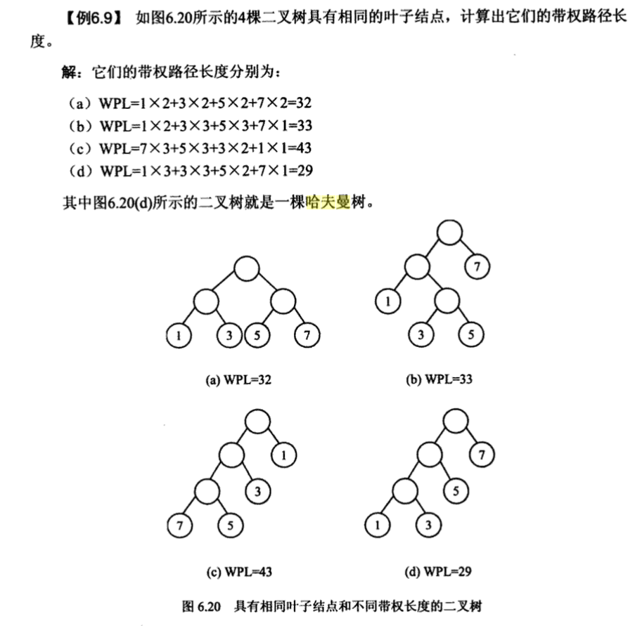
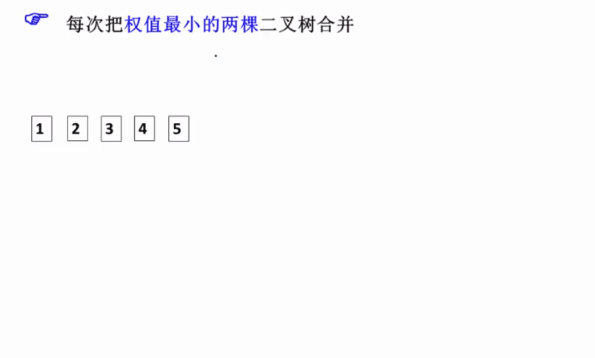
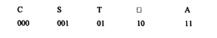
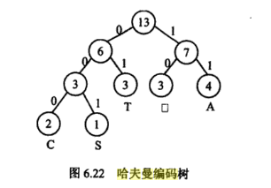
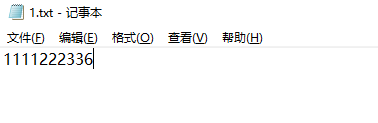
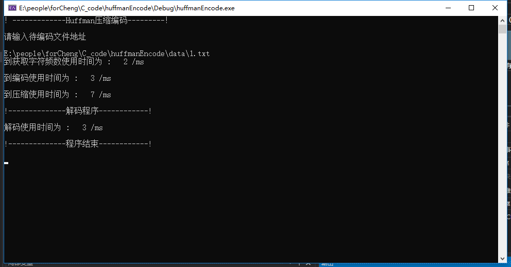

# 哈夫曼编码

## 哈夫曼树

> 哈夫曼树（Huffman Tree）也是一种特殊的二叉树，这种树的所有叶子结点都带有权值，从中构造出带权路径长度最短的二叉树，即哈夫曼树。

### 哈夫曼树的定义

​		设二叉树具有n个带权值的叶子结点,那么从根结点到各个叶子结点的路径长度与相应结点权值的乘积的和,叫做二叉树的带权路径长度,记作:
$$
\mathrm{WPL}=\sum_{i=1}^{n} \mathbf{w}_{i} \times l_{i}
$$
其中,为第i个叶子结点的权值,l为第i个叶子结点的路径长度。如图6.19所示的二叉树,
它的带权路径长度值WPL=1×3+3×3+2×2+4×1=20  



如果给定一组具有确定权值的叶子结点· 可以构造出不同的带权二叉树， 它们的带权路径长度并不相同· 我们把其中具有最小带权路径长度的二叉树称为哈夫曼树·.



### 哈夫曼树的构造



## 哈夫曼编码

​		哈夫曼编码具有广泛的应用， 利用哈夫曼树构造的用于通信的二进制编码称为哈夫曼编码。例如： 有一段电文“ CAST囗TAT囗A囗SA "（ 其中,“ 囗” 表示一个空格） 。统计电文中字母的频度															f('C')=1,f('S')=2,f('T')=3,f('囗')=3,f('A')=4 。

用频度{ 1 ， 2 ， 3 ， 3 ， 4 } 为权值生成哈夫曼树． 并在每个叶子上注明对应的字符。树中从根到每个叶子都有一条路径， 对路径上的各分枝约定指向左子树根的分枝表示“ 0 ” 码， 指向右子树的分枝表示“ 1 ” 码， 取每条路径上的“ 0 ” 或“ 1 ” 的序列作为和各个叶子对应的字符的编码， 这就是哈夫曼编码。对应图6- 22 的哈夫曼树，上述字符编码为：





### 编码过程：


## 信源熵

在[信息论](https://zh.wikipedia.org/wiki/信息论)中，**熵**（英语：entropy）是接收的每条消息中包含的信息的平均量，又被称为**信息熵**、**信源熵**、**平均自信息量**。这里，“消息”代表来自分布或数据流中的事件、样本或特征。（熵最好理解为不确定性的量度而不是确定性的量度，因为越随机的信源的熵越大。）来自信源的另一个特征是样本的概率分布。这里的想法是，比较不可能发生的事情，当它发生了，会提供更多的[信息](https://zh.wikipedia.org/wiki/信息)。由于一些其他的原因，把信息（熵）定义为概率分布的对数的相反数是有道理的。事件的概率分布和每个事件的信息量构成了一个随机变量，这个随机变量的均值（即[期望](https://zh.wikipedia.org/wiki/数学期望)）就是这个分布产生的信息量的平均值（即熵）。熵的单位通常为比特，但也用Sh、nat、Hart计量，取决于定义用到对数的底。

采用概率分布的对数作为信息的量度的原因是其可加性。例如，投掷一次硬币提供了1 Sh的信息，而掷m次就为m位。更一般地，你需要用log2(*n*)位来表示一个可以取*n*个值的变量。

在1948年，[克劳德·艾尔伍德·香农](https://zh.wikipedia.org/wiki/克劳德·艾尔伍德·香农)将热力学的熵，引入到[信息论](https://zh.wikipedia.org/wiki/信息论)，因此它又被称为**香农熵**。

### 熵的计算

当取自有限的样本时，熵的公式可以表示为：

$$
\mathrm{H}(X)=\sum_{i} \mathrm{P}\left(x_{i}\right) \mathrm{I}\left(x_{i}\right)=-\sum_{i} \mathrm{P}\left(x_{i}\right) \log _{b} \mathrm{P}\left(x_{i}\right)
$$
在这里*b*是[对数](https://zh.wikipedia.org/wiki/對數)所使用的[底](https://zh.wikipedia.org/wiki/底数_(对数))，通常是2,自然常数[e](https://zh.wikipedia.org/wiki/E_(数学常数))，或是10。当*b* = 2，熵的单位是[bit](https://zh.wikipedia.org/wiki/位元)；当*b* = e，熵的单位是[nat](https://zh.wikipedia.org/wiki/奈特_(单位))；而当*b* = 10,熵的单位是Hart。

## 程序实现：

### 文件结构

```c++
.
├── code
│   ├── huffmanClass.h		
│   └── huffmanCode.cpp		//主程序
├── data
│   ├── 1.txt				//待压缩文本文件
│   ├── pic.bmp				//待压缩图像文件
│   ├── 1.txt.data				//压缩后的文本文件
│   ├── pic.bmp.data			//压缩后的图像文件
│   ├── 1.txt.txt					//解码后恢复的文本文件
│   └──  pic.bmp.bmp				//解码后恢复的图像文件
│ 
├── huffmanEncode			//vs2019工程文件夹
├── huffmanEncode.sln 		//点击打开工程
└── 哈夫曼编码.md

```
### 核心代码介绍

#### 字频统计code

> 对每个出现的字节进行统计

```c++
void Huffman::count()
{
	ifstream readfile;
	readfile.open(fileAddress, ios::in | ios::binary);
	unsigned char *now = new unsigned char;  //存储当前读取到的字符
	CountVector* temp = new CountVector;  
	for (int i = 0; i < 256; i++) {
		temp->value = i;
		temp->frequency=0;
		charCountFrequency.push_back(*temp);
	}
	while (!readfile.eof())
	{
		readfile.read((char*)now, sizeof(unsigned char));
		charCountFrequency[*now].frequency++;//只需要在对应的位置上将字频增加
		NumOfChar++;
	}
	charCountFrequency[*now].frequency--;
	readfile.close();

}
```

#### 构建哈夫曼树code

> 根据字频表，每次选取频率最小的两个组成一组，然后权值相加放入字频表，再选字频最小的两个。

```c++
void Huffman::CreateHuffmanTree(vector<CountVector> charFrequency)
{
	vector<CountVector>  buildtree;
	//HuffmanNode newNode;
	HuffmanNode* rootnode = new HuffmanNode;
	buildtree = charFrequency;
	sort(buildtree.begin(), buildtree.end(), mysortfunction);
	vector<CountVector>::iterator last = buildtree.begin();
	for (int i = 0; i < buildtree.size(); i++) {
		if (buildtree[i].frequency != 0) {
			if (last != buildtree.begin()) {
				buildtree.erase(buildtree.begin(), last);
			}
			break;
		}
		last++;
	}
	int treedepth = 0;
	while (buildtree.size() > 1)
	{
		HuffmanNode* nodeLeft = new HuffmanNode,
			* nodeRight = new HuffmanNode,
			* newNode = new HuffmanNode;
		CountVector insertnew;
		if (buildtree[0].nodeAddress != NULL)
		{  //如果是叶子节点的话  左右子树的地址都为NULL
			nodeLeft->Lchild = buildtree[0].nodeAddress->Lchild;
			nodeLeft->Rchild = buildtree[0].nodeAddress->Rchild;
		}
		else
		{
			nodeLeft->Lchild = NULL;
			nodeLeft->Rchild = NULL;
		}
		if (buildtree[1].nodeAddress != NULL)
		{
			nodeRight->Lchild = buildtree[1].nodeAddress->Lchild;
			nodeRight->Rchild = buildtree[1].nodeAddress->Rchild;
		}
		else
		{
			nodeRight->Lchild = NULL;
			nodeRight->Rchild = NULL;
		}
		nodeLeft->frequency = buildtree[0].frequency;
		nodeLeft->value = buildtree[0].value;
		nodeRight->frequency = buildtree[1].frequency;
		nodeRight->value = buildtree[1].value;
		newNode->frequency = nodeRight->frequency + nodeLeft->frequency;
		newNode->Lchild = nodeLeft;
		newNode->Rchild = nodeRight;
		insertnew.frequency = newNode->frequency;
		insertnew.value = 0;
		insertnew.nodeAddress = newNode;
		buildtree.erase(buildtree.begin());
		buildtree.erase(buildtree.begin());
		buildtree.insert(buildtree.begin(), insertnew);
		sort(buildtree.begin(), buildtree.end(), mysortfunction);   //每次更新完要排序
		rootnode = newNode;
		treedepth++;

	}
	root = rootnode;
}
```

#### 生成哈夫曼码表

> 递归的方法找到每个叶子的路径，走左边为0，走右边为1.

```c++
void  Huffman::GetHuffmanCode(HuffmanNode* root, int depth)
{
	static char code[512];
	//判断左儿子
	if (root->Lchild != NULL)
	{
		code[depth] = '0';
		code[depth + 1] = '\0';
		GetHuffmanCode(root->Lchild, depth + 1);
	}
	if (root->Rchild != NULL)
	{
		code[depth] = '1';
		code[depth + 1] = '\0';
		GetHuffmanCode(root->Rchild, depth + 1);
	}
	else
	{
		int codelength = 0;
		for (int j = 0; code[j] != '\0'; j++)
		{
			codelength++;
		}
		HuffmanCodeTable[root->value].codelen = codelength;
		HuffmanCodeTable[root->value].code = (string)code;//直接把编码放到对应value位置上
	}

}
```

#### 总结

> 在实现字频查找和编码表的生成，都采用直接建表，在对应value位置上赋值，提高了压缩速度。
>
> [3]中生成字频代码如下,需要对每个读取的字符与已有的字频表进行匹配，时间复杂度很高。优化以后，效率提高了近十倍。

```c++
void Huffman::count()
{
	ifstream readfile;
	readfile.open(fileAddress, ios::in | ios::binary);
	unsigned char *now = new unsigned char;  //存储当前读取到的字符
	while (!readfile.eof())
	{
		CountVector *presentChar = new CountVector;  //读取到的字符信息
		readfile.read((char*)now, sizeof(unsigned char));
		int flag = 0;   //标志是否是新出现的字符
		for (int i = 0; i < charCountFrequency.size(); i++)
		{
			if (*now == charCountFrequency[i].value)
			{
				charCountFrequency[i].frequency++;
				NumOfChar++;
				flag = 1;
			}

		}
		if (flag == 0)
		{
			presentChar->value = *now;
			presentChar->frequency++;
			NumOfChar++;
			charCountFrequency.push_back(*presentChar);
		}
	}
	readfile.close();
}
```

## 结果显示：

- **对一个文本文件进行编码压缩和解码，如下：**



**运行结果：**



**生成文件：**（1.txt.data是编码后的输出文件，1.txt.txt是解码文件）


- **输入一张bmp图片。**

  

  **编码压缩后：**

  

  > 大小是原来的48%。

- 选取了三张图片，对比一下理想信源熵和平均码长

  > 图片1信源熵：3.755210 .平均码长：3.814355
  > 图片2信源熵：4.914732 .平均码长：4.942633
  > 图片3信源熵：3.586430 .平均码长：3.654054

  可以看到哈夫曼编码很接近香农熵。

## 参考：

> [[1]数据结构与算法教程-李春葆-125页](https://books.google.com.hk/books?id=22dr0lo94OgC&pg=PA129&dq=%E5%93%88%E5%A4%AB%E6%9B%BC%E7%BC%96%E7%A0%81%E7%AE%97%E6%B3%95&hl=zh-CN&sa=X&ved=0ahUKEwjTxoy8xKniAhUS_GEKHUZhC2cQ6AEIKDAA#v=onepage&q=%E5%93%88%E5%A4%AB%E6%9B%BC%E7%BC%96%E7%A0%81%E7%AE%97%E6%B3%95&f=false)
>
> [[2]https://github.com/FLHonker/HffmanCompress](https://github.com/FLHonker/HffmanCompress)
>
> [[3]https://github.com/PiggyGaGa/Information-Theory-Source-Coding](https://github.com/PiggyGaGa/Information-Theory-Source-Coding)
>
> [[4]Matlab霍夫曼编码器](https://www.mathworks.com/help/comm/ref/huffmanenco.html)